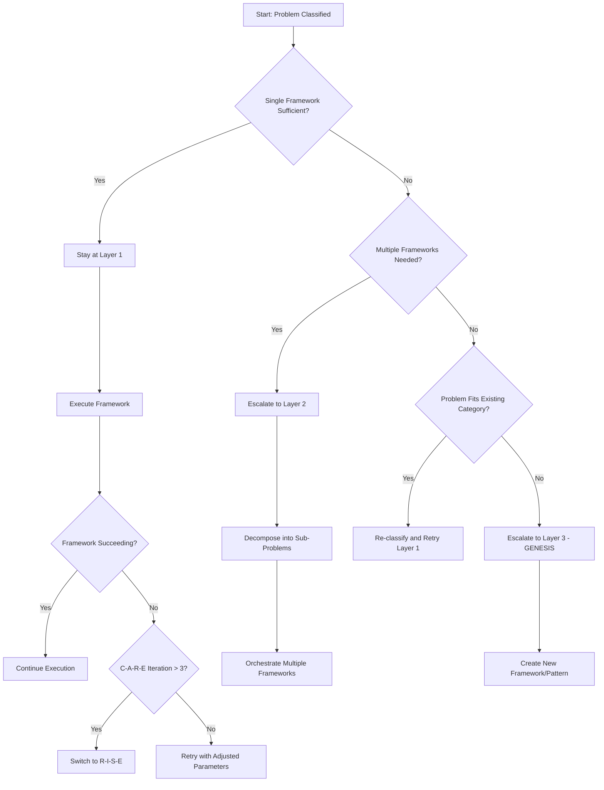
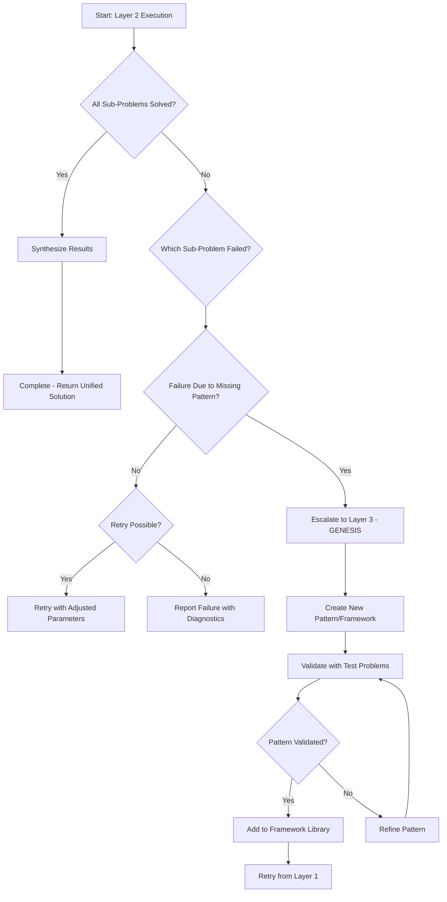
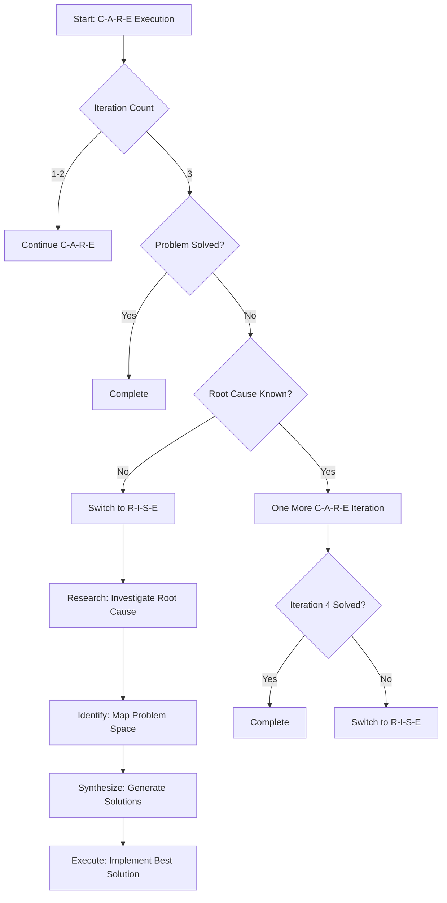

# Escalation Decision Tree

**Version:** 1.0
**Purpose:** Visual decision trees for determining when to escalate from Layer 1 to Layer 2 or Layer 3

---

## Overview

The FORGE uses a 3-layer architecture:
- **Layer 1: EXECUTION** — Apply existing frameworks to single problems
- **Layer 2: ORCHESTRATION** — Coordinate multiple frameworks for complex tasks
- **Layer 3: GENESIS** — Create new frameworks when existing ones don't fit

This document provides decision trees and trigger tables to help determine when to escalate between layers.

---

## Layer 1 → Layer 2 Escalation

### Decision Tree



### When to Escalate Layer 1 → Layer 2

| Condition | Action |
|-----------|--------|
| Problem requires both research AND iteration | Use R-I-S-E for research, C-A-R-E for refinement |
| Multiple domains involved (e.g., backend + frontend) | Orchestrate with domain switches |
| Task has distinct phases with different methodologies | Decompose and sequence frameworks |
| Single framework making no progress after 3 iterations | Decompose problem further |

### When to Stay at Layer 1

| Condition | Action |
|-----------|--------|
| Problem is well-defined and fits one category | Execute single framework |
| Domain module exists and applies | Apply domain standards |
| Complexity is moderate or simple | No need to orchestrate |
| Previous similar problems solved successfully | Reuse approach |

---

## Layer 2 → Layer 3 Escalation

### Decision Tree



### When to Escalate Layer 2 → Layer 3

| Condition | Action |
|-----------|--------|
| No existing framework fits the problem type | Create new framework via GENESIS |
| Repeated failures due to missing pattern | Identify and create the pattern |
| Cross-domain task has no orchestration guide | Create orchestration template |
| New problem category discovered | Define category and framework mapping |

### When to Stay at Layer 2

| Condition | Action |
|-----------|--------|
| Sub-problems map to existing frameworks | Continue orchestration |
| Handoffs between frameworks are clear | Execute sequence |
| Dependencies are manageable | Follow execution order |
| Results can be synthesized | Combine sub-problem outputs |

---

## C-A-R-E → R-I-S-E Escalation

### Decision Tree



### Escalation Triggers

| Trigger | From | To | Rationale |
|---------|------|-----|-----------|
| C-A-R-E exceeds 3 iterations | C-A-R-E | R-I-S-E | Need deeper research |
| Root cause unknown | C-A-R-E | R-I-S-E | Research phase needed |
| Multiple frameworks needed | Layer 1 | Layer 2 | Orchestration required |
| No framework fits | Layer 1/2 | Layer 3 | Create new framework |
| Pattern gap identified | Layer 2 | Layer 3 | Create new pattern |
| Cross-domain complexity | Layer 1 | Layer 2 | Multi-domain orchestration |

---

## Quick Reference

### Layer Decision Matrix

| Problem Characteristics | Recommended Layer |
|------------------------|-------------------|
| Single domain, clear category, moderate complexity | Layer 1 |
| Multiple domains OR multiple frameworks needed | Layer 2 |
| No existing framework OR pattern gap | Layer 3 |

### Framework Selection Within Layer 1

| Category | Primary Framework | Escalation Trigger |
|----------|------------------|-------------------|
| CREATION | R-I-S-E | None (research is appropriate) |
| TRANSFORMATION | R-I-S-E | None (research is appropriate) |
| UNDERSTANDING | HARVEST | Complex research → R-I-S-E |
| REPAIR | C-A-R-E | Unknown root cause → R-I-S-E |
| OPTIMIZATION | C-A-R-E | Complex optimization → R-I-S-E |

---

## Examples

### Example 1: Simple Bug Fix (Stay at Layer 1)

```
Problem: "Button click not working"
Classification: REPAIR
Framework: C-A-R-E
Iterations: 2 (found and fixed missing event handler)
Result: Complete at Layer 1
```

### Example 2: Complex Feature (Escalate to Layer 2)

```
Problem: "Build full-stack user authentication"
Classification: CREATION
Initial Framework: R-I-S-E

Sub-Problems:
  SP-1: Design auth API (R-I-S-E)
  SP-2: Implement backend (C-A-R-E)
  SP-3: Build login UI (R-I-S-E)
  SP-4: Integrate frontend (C-A-R-E)
  SP-5: Write documentation (HARVEST)

Result: Layer 2 orchestration successful
```

### Example 3: Novel Problem Type (Escalate to Layer 3)

```
Problem: "Create AI agent for automated trading"
Classification: CREATION
Attempt: R-I-S-E

Issue: No existing pattern for agent autonomy + financial constraints
Decision: Escalate to Layer 3

GENESIS Actions:
  1. Identify gap: "Autonomous Agent Framework" needed
  2. Design: SAFE loop (Sense → Analyze → Filter → Execute)
  3. Validate: Test with simulated trades
  4. Integrate: Add to framework library

Result: New framework created, problem solved with SAFE + R-I-S-E
```

---

## Related Documents

- [FORGE_MASTER.md](../FORGE_MASTER.md) — Master prompt with framework definitions
- [meta_framework.md](meta_framework.md) — 3-layer architecture details
- [omega_loop.md](omega_loop.md) — Self-improvement loop
- [problem_classifier.md](problem_classifier.md) — Problem classification logic
- [universal_rise.md](universal_rise.md) — R-I-S-E framework details
- [universal_care.md](universal_care.md) — C-A-R-E framework details

---

*This document is part of the FORGE enhancement initiative.*

