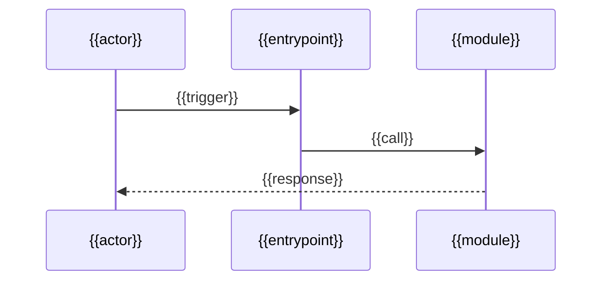

<!--
  TEMPLATE — data-flow.md
  Trace how a request/command/event travels end to end. Describe; don't copy code.
-->
# {{project_name}} — Data & Control Flow

## Primary flow
{{name_the_main_path_eg_http_request_or_cli_command}}

## Step by step
1. **Entry** — {{where_it_starts}}
2. **{{stage}}** — {{what_happens}}
3. **Exit** — {{what_comes_back_or_gets_persisted}}

## State & persistence
- **Stores:** {{db_cache_files_queues}}
- **What's stored / read where:** {{summary}}

## Configuration & secrets
- **Config sources:** {{env_files_flags}}
- **Secrets handling:** {{how_secrets_are_loaded}}

## Error / edge paths
- {{notable_failure_or_edge_case_and_how_its_handled}}

---
**CONFIDENCE:** {{1-10}} | **REASONING:** {{why}}
